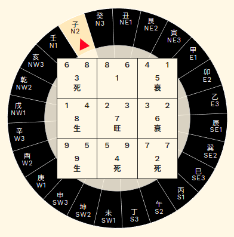
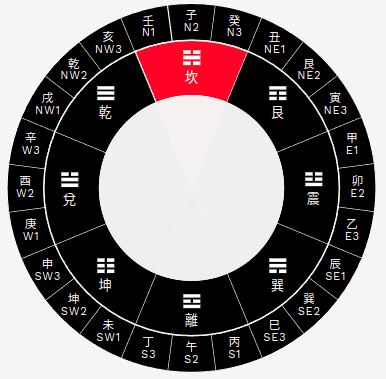
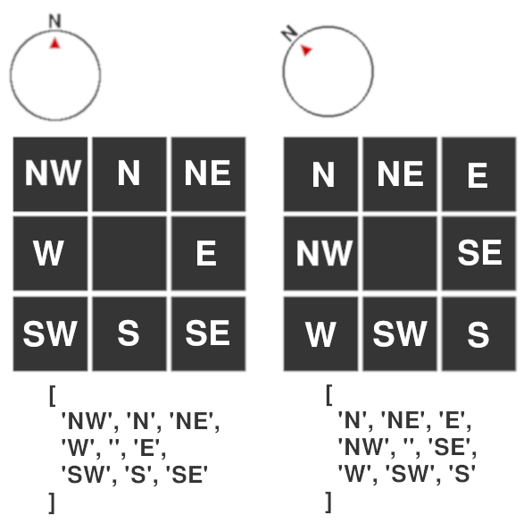

# mikaboshi




## 1. About

__"mikaboshi"__ is a calculation library for Chinese astrology (written in Rust),
specifically, for _"Feng-Shui"_ (風水 or 风水).
The name __"mikaboshi"__ derives from a Marvel character
["Amatsu-Mikaboshi"](https://marvel.fandom.com/wiki/Amatsu-Mikaboshi_(Earth-616)),
or one of the goddesses in Shinto myth.
"Amatsu-Mikaboshi" (アマツミカボシ),
when literally translated, means _"the shinning star in the sky"_.

Supported (Chinese astrological) concepts are:

- [八卦 (Ba-Gua)](./docs/bagua.md)
- [干支 (Gan-Zhi)](./docs/ganzhi.md)
- [九星 (Jiu-Xing)](./docs/jiuxing.md)
- [二十四节气 (Er-Shi-Si Jie-Qi)](./docs/solar_terms.md)
- [二十四山向 (Er-Shi-Si Shan-Xiang)](./docs/compass.md)
- [生死衰旺 (Sheng-Si Shuai-Wang)](./docs/shengsi.md)

This library depends on
["sowngwala"](https://github.com/minagawah/sowngwala/)
for calculating sun's position.
For both "mikaboshi" and "sowngwala" use
[chrono](https://crates.io/crates/chrono)
for managing date & time.

You may have noticed many examples found in
[samples](./docs/examples/index.md) are that of WASM apps.
Yet, it does not mean you need WASM apps.
It is just that I happen to have a WASM app using the library,
and was easy for me to share the codes...

__What Makes The Program Tricky?__

So, the library expects you to have
a Feng-Shui board with 9 boxes drawn on a device screen.
1 empty box in the middle surrounded by 8 boxes.
360 divided by 8, makes it 45 degrees for each.  
See how it goes when pointing "N" (north):

(When pointing "N")  
1st row &dash;&dash;&gt; "NW", "N", and "NE"  
2nd row &dash;&dash;&gt; "W", (middle), and "E"  
3rd row &dash;&dash;&gt; "SW", "S", and "SE"  



However, it gets tricky when device rotates.
Say, the device rotates for 45 degrees clockwise.
It now points to "NE" (north-east):  

(When pointing "NE")  
1st row &dash;&dash;&gt; "N", "NE", and "E"  
2nd row &dash;&dash;&gt; "NW", (middle), and "SE"  
3rd row &dash;&dash;&gt; "W", "SW", and "S"  

As you can imagine, when the above is expressed in a Rust program,
we need `Vec` and `HashMap`, and that is why we have
many `Vec` and `HashMap` as to map variations
that manifest per compass direction
(usually 8, but sometimes 9 when center is concerned).
This is so, not only for compass directions,
but for Feng-Shui mappings as well.
Whenever we calculate positions for Feng-Shui elements,
the positions are provided in `Vec` or `HashMap`
so that they will have 8 or 9 patterns.


## 2. Examples

I have a few [examples](./docs/examples/index.md) which may, or may not help...


## 3. Documentation

You may:

```bash
cargo doc
```

However, you will probably learn more from the online documentations bellow.  
Each page provides general descriptions about what they are,
and also provide some examples.
You can also explore the actual codes for they contain a lot of _doc tests_.

### [八卦 (Bagua)](./docs/bagua.md)

- [Bagua](./docs/bagua.md#baguabagua)
- [BaguaRawData](./docs/bagua.md#baguabaguarawdata)
- [BAGUA](./docs/bagua.md#baguabagua)
- [BAGUA_START_NORTH_INDEXES](./docs/bagua.md#baguabagua_start_north_indexes)
- [BAGUA_START_NORTH](./docs/bagua.md#baguabagua_start_north)
- [get_bagua_start_north](./docs/bagua.md#baguaget_bagua_start_north)  

### [干支 (Gan-Zhi)](./docs/ganzhi.md)

- [Stem](./docs/ganzhi.md#ganzhistem)
- [Branch](./docs/ganzhi.md#ganzhibranch)
- [StemRawData](./docs/ganzhi.md#ganzhistemrawdata)
- [BranchRawData](./docs/ganzhi.md#ganzhibranchrawdata)
- [GanZhi](./docs/ganzhi.md#ganzhiganzhi)
- [Bazi](./docs/ganzhi.md#ganzhibazi)
- [STEMS](./docs/ganzhi.md#ganzhistems)
- [BRANCHES](./docs/ganzhi.md#ganzhibranches)
- [GANZHI_SEXAGESIMAL](./docs/ganzhi.md#ganzhiganzhi_sexagesimal)
- [HOUR_STEM_TABLE](./docs/ganzhi.md#ganzhihour_stem_table)
- [Bazi::from_local](./docs/ganzhi.md#ganzhibazifrom_local)  

### [九星 (Jiu-Xing)](./docs/jiuxing.md)

- [JiuXing](./docs/jiuxing.md#jiuxingjiuxing)
- [JiuXingRawData](./docs/jiuxing.md#jiuxingjiuxingrawdata)
- [XiaGuaTu](./docs/jiuxing.md#jiuxingxiaguatu)
- [DIRECTION_TO_JIU_XING](./docs/jiuxing.md#jiuxingdirection_to_jiu_xing)
- [JIU_XING](./docs/jiuxing.md#jiuxingjiu_xing)
- [JIU_XING_DI_PAN_POSITIONS](./docs/jiuxing.md#jiuxingjiu_xing_di_pan_positions)
- [get_jiuxing_dipan_positions_from_direction](./docs/jiuxing.md#jiuxingget_jiuxing_dipan_positions_from_direction)
- [get_jiuxing_from_index](./docs/jiuxing.md#jiuxingget_jiuxing_from_index)
- [normalize_jiuxing](./docs/jiuxing.md#jiuxingnormalize_jiuxing)
- [fly_flying_stars](./docs/jiuxing.md#jiuxingfly_flying_stars)  
- [get_xiaguatu_from_unpan_index](./docs/jiuxing.md#jiuxingget_xiaguatu_from_unpan_index)  

### [二十四节气 (Er-Shi-Si Jie-Qi) and 立春 (Li-Chun)](./docs/solar_terms.md)

- [get_last_term](./docs/solar_terms.md#solar_termsget_last_term)
- [get_lichun](./docs/solar_terms.md#solar_termsget_lichun)  

### [二十四山向 (Er-Shi-Si Shan-Xiang)](./docs/compass.md)

- [Direction](./docs/compass.md#compassdirection)
- [TwentyFourType](./docs/compass.md#compasstwentyfourtype)
- [DIRECTIONS](./docs/compass.md#compassdirections)
- [OPPOSITE_DIRECTION](./docs/compass.md#compassopposite_direction)
- [DIRECTION_POSITIONS_IN_CHART](./docs/compass.md#compassdirection_positions_in_chart)
- [TWENTYFOUR_DIRECTIONS_TO_INDEX](./docs/compass.md#compasstwentyfour_directions_to_index)
- [TWENTYFOUR_INDEX_TO_DIRECTIONS](./docs/compass.md#compasstwentyfour_index_to_directions)
- [TWENTYFOUR_ORDER_START_NORTH](./docs/compass.md#compasstwentyfour_order_start_north)
- [TWENTYFOUR_SECTORS](./docs/compass.md#compasstwentyfour_sectors)
- [get_direction_positions_in_chart](./docs/compass.md#compassget_direction_positions_in_chart)
- [get_opposite_direction](./docs/compass.md#compassget_opposite_direction)
- [get_twentyfour_data_from_direction](./docs/compass.md#compassget_twentyfour_data_from_direction)
- [get_twentyfour_data_from_index](./docs/compass.md#compassget_twentyfour_data_from_index)
- [get_twentyfour_direction_from_degrees](./docs/compass.md#compassget_twentyfour_direction_from_degrees)
- [get_twentyfour_direction_from_direction](./docs/compass.md#compassget_twentyfour_direction_from_direction)
- [get_twentyfour_direction_from_index](./docs/compass.md#compassget_twentyfour_direction_from_index)
- [get_twentyfour_index_from_direction](./docs/compass.md#compassget_twentyfour_index_from_direction)  

### [生死衰旺 (Sheng-Si Shuai-Wang)](./docs/shengsi.md)

- [ShengSi](./docs/shengsi.md#shengsishengsi)
- [ShengSiYearlyAlloc](./docs/shengsi.md#shengsishengsiyearalloc)
- [SHENG_SI](./docs/shengsi.md#shengsisheng_si)
- [SHENG_SI_ALLOC](./docs/shengsi.md#shengsisheng_si_alloc)
- [get_shengsi_mapping](./docs/shengsi.md#shengsiget_shengsi_mapping)  

### [Planets](./docs/planet.md)

- [Planet](./docs/planet.md#planet)
- [PlanetRawData](./docs/planet.md#planetrawdata)
- [PLANETS](./docs/planet.md#planets)

## 4. Test

```
RUST_BACKTRACE=1 cargo test -vv -- --nocapture
```

## 5. Dislaimer

There is absolutely no gurantee about the accuracy of the service,
information, or calculated results provided by the program,
and the author of the program cannot be held responsible
in any ways for any adverse consequences.
It is solely for entertaniment only, and your use of the service,
information, or calculated results is entirely at your own risks,
for which the author of the program shall not be liable.
It shall be your own responsibility to ensure the service,
information, or calculated results meet your specific requirements.


## 6. License

MIT license ([LICENSE](LICENSE))
