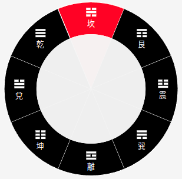

# 八卦 (Bagua)

Source: [src/bagua.rs](../src/bagua.rs)



Although 八卦 (Ba-Gua) is a concept in 易経 (I-Ching),
when used in Feng-Shui, it is often associated with 九星 (Jiu-Xing).
While everthing in this world is (said to be) divided into either 陰 (Yin)
or 陽 (Yang), each could be further divided into lesser Yin and Yang.
For Yang, some may be abundant in Yang. Or, some may slightly lean toward Yin.
This goes for Yin as well. Here, the initial Yin and Yang,
now divided into 4, or becomes 4 patterns. Then, for each,
there are further divisions, and for this time, it now makes it 8 patterns.
Ancient Chinese had a specific term for these 8 patterns,
and it is called, 八卦 (Ba-Gua), or "8 Gua".

[0] 坎 (Kan)  
[1] 坤 (Kun)  
[2] 震 (Zhen)  
[3] 巽 (Xun)  
[4] 乾 (Qian)  
[5] 兌 (Dui)  
[6] 艮 (Gen)  
[7] 離 (Li)  


## bagua::Bagua

A struct representing 卦 (Gua) and stores its attributes.

```rust
#[derive(Debug, Clone, Serialize, Deserialize)]
pub struct Bagua {
    pub num: u8,
    pub name: Language,
    pub direction: String,
    pub element: u8,
}
```

## bagua::BaguaRawData

A temporary struct for loading JSON data when defining a static const `BAGUA`.

```rust
#[derive(Debug, Clone, Serialize, Deserialize)]
pub struct BaguaRawData {
    pub num: u8,
    pub name: LanguageData,
    pub direction: String,
    pub element: u8,
}
```

## bagua::BAGUA

`Vec<Bagua>`
 
A static vector with 9 items, each represents 卦 (Gua) of 八卦 (Ba-Gua),
or what known as "Eight Trigrams". Each stores associated attributes
for the 卦 (Gua), and are in the order of Ba-Gua Numbers. For instance,
坎 (Kan) is the first in Ba-Gua, so it comes first in the vector.
However, be careful when you refer to each 卦 (Gua) as the program
refers 卦 (Gua) not by Ba-Gua Numbers, but by vector indexes.
For 坎 (Kan), for instance, while it has the Ba-Gua Number of 1,
it is referred as 0 because that is the index is for 坎 (Kan).

[0] 坎 (1 = Kan)  
[1] 坤 (2 = Kun)  
[2] 震 (3 = Zhen)  
[3] 巽 (4 = Xun)  
[4] 中 (5 = Zhong)  
[5] 乾 (6 = Qian)  
[6] 兌 (7 = Dui)  
[7] 艮 (8 = Gen)  
[8] 離 (9 = Li)  
 
For attributes details stored in the vector is found in JSON file:
[json/bagua.json](../json/bagua.json)

## bagua::BAGUA_START_NORTH_INDEXES

`Vec<u8>`
 
Another static vector for 八卦 (Ba-Gua) (and is `Vec<u8>`).
However, this time, it has only 8 items because this is used
for compass rotation. When using a compass, only 8 directions matter,
and the middle does not mean anything. When 八卦 (Ba-Gua) are
placed in 洛書 (Lo-Shu) order, 中 (Zhong) comes in the middle.
So, 中 (Zhong) is missing for this vector. For 八卦 (Ba-Gua),
it begins with 坎 (Kan) which resides in the north
when they are placed in Lo-Shu order. Moving clockwise,
what you see next in the north-east, is 艮 (Gen).
Then, comes 震 (3 = Zhen) which is in the east, and, so on.

[0] 坎 (1 = Kan)  
[1] 艮 (8 = Gen)  
[2] 震 (3 = Zhen)  
[3] 巽 (4 = Xun)  
[4] 離 (9 = Li)  
[5] 坤 (2 = Kun)  
[6] 兌 (7 = Dui)  
[7] 乾 (6 = Qian)  

## bagua::BAGUA_START_NORTH

`Vec<Bagua>`

While the order is the same as `BAGUA_START_NORTH_INDEXES`,
for this time, it is `Vec<Bagua>` instead of `Vec<u8>`.

## bagua::get_bagua_start_north

A getter for `BAGUA_START_NORTH`.

Example:
```rust
use mikaboshi::bagua::{get_bagua_start_north, Bagua};
use wasm_bindgen::prelude::*;

#[wasm_bindgen]
pub fn xx(index: usize) -> JsValue {
    let bagua: Option<&Bagua> = get_bagua_start_north(index);
    JsValue::from_serde(&bagua).unwrap()
}
```
