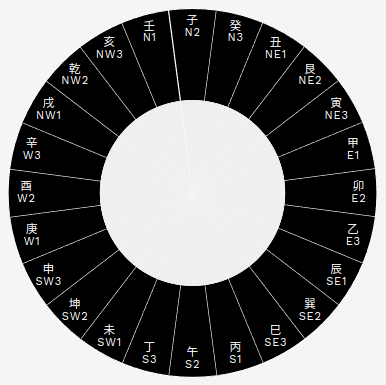

# 二十四山向 (Er-Shi-Si Shan-Xiang)

Source: [src/compass.rs](../src/compass.rs)



A module for compass directions. When dividing 360 degrees into 8,
we get 45 degrees. Ancient Chinese further divided them each into 3
(called "sectors"), each having 15 degrees. Meaning, there are
24 sectors as a total. This is called, 二十四山向 (Er-Shi-Si Shan-Xiang).
Not only for 8 directions, but these 24 directions (sectors)
are used in Feng-Shui, and this is the module for these directions.

Reference:
- [二十四山 - Wiki](https://ja.wikipedia.org/wiki/%E4%BA%8C%E5%8D%81%E5%9B%9B%E5%B1%B1)


## compass::Direction

A struct representing compass direction.
For each direction, there are 3 sectors.

Example:
```rust
#[derive(Debug, Clone, PartialEq, Serialize, Deserialize)]
pub struct Direction {
    pub direction: String,
    pub sector: usize,
}
```

## compass::TwentyFourType

二十四山向 (Er-Shi-Si Shan-Xiang) can be either 卦 (Gua), 干 (Gan), or 支 (Zhi).

```rust
pub enum TwentyFourType<'a> {
    Bagua(&'a Bagua),
    Stem(&'a Stem),
    Branch(&'a Branch),
}
```

## compass::DIRECTIONS

`[&str; 8]`

An array for 8 directions.

```rust
pub const DIRECTIONS: [&str; 8] =
  ["n", "ne", "e", "se", "s", "sw", "w", "nw"];
```

## compass::OPPOSITE_DIRECTION

`HashMap<&str, &str>`

A hash map for the opposite direction.

## compass::DIRECTION_POSITIONS_IN_CHART

`HashMap<&str, [&str; 9]>`

A hash map with 9 items.
Say, we have 9 boxes displayed on a device screen.
Except for the box in the middle, we have 8 boxes
around the middle to represent 8 compass directions.
When facing "n" (north), for the first row,
we have "nw", "n", and "ne". For the second row,
we have "w", "", and "e" (where "" being the middle box).
For the last, we have "sw", "s", and "se".

[0] nw  [1] n   [2] ne  
[3] w   [4]     [5] e  
[6] sw  [7] s   [8] se  

Now, consider when the device rotates.
Depending on which direction the device is facing,
we have different labels. For all 8 directions,
this HashMap provides a map for the positions.

## compass::TWENTYFOUR_DIRECTIONS_TO_INDEX

`HashMap<String, usize>`

A HashMap mapping direction (combination of "direction" and "sector")
to the corresponding index.

n2: 0  
n3: 1  
ne1: 2  
ne2: 3  
...  
...

## compass::TWENTYFOUR_INDEX_TO_DIRECTIONS

`Vec<Direction>`

An array with 24 items, for each represents
each in 二十四山向 (Er-Shi-Si Shan-Xiang).
Note, the array begins with "N2"
(and "N1" is stored at the very last, or [23]).  

0: Direction { direction: "n", sector: 2 }  
1: Direction { direction: "n", sector: 3 }  
2: Direction { direction: "ne", sector: 1 }  
3: Direction { direction: "ne", sector: 2 }  
...  
...

## compass::TWENTYFOUR_ORDER_START_NORTH

`[(usize, usize); 24]`

An array with 24 items, each being a tuple. For each tuple,
the first represents the type of "二十四山向" (Er-Shi-Si Shan-Xiang),
and the second is the index of the type.
The type being: [0] BAGUA, [1] STEM, or [2] BRANCH.

(2, 0) --> [0] 子  
(1, 9) --> [9] 癸  
(2, 1) --> [1] 丑  
(0, 7) --> [7] 艮  
(2, 2) --> [2] 寅  
(1, 0) --> [0] 甲  
...  
...

## compass::TWENTYFOUR_SECTORS

`[u8; 24]`

An array with 24 items. Imagine having a circlar disc displayed
on a device screen. When dividing 360 by 8 directions, we get
45 degrees for each. When each direction is further divided
into 3, then each is called a "sector", and it has 15 degrees
for each "sector". Sectors are placed in clockwise order
(left to right) for each direction, so that you see
the sector 1 being placed on your very left. Then, you see
the sector 2 in the middle, and the sector 3 on your right.
Imagine the device pointing north. On the circular disc,
what you see at the very top is the sector 2 of "N" (north),
denoted as "N2". On your left, you see "N1".
On your right, "N3".

When we want to express all the 24 sectors, we want
an array with 24 items. For the first item in the array [0],
it is convenient to have "N2". Then, for the second item
in the array [1], we want "N3". For [2], we want "NE1".
For [3], we want "NE2". And, so on. As you can imagine,
"N1" comes to the very last in the array, or [23].

2 --> n  
3 --> n  
1 --> ne  
2 --> ne  
3 --> ne  
1 --> e  
...  
...

## compass::get_direction_positions_in_chart

An getter for `DIRECTION_POSITIONS_IN_CHART`.

Example:

```rust
use mikaboshi::compass::get_direction_positions_in_chart;
use wasm_bindgen::prelude::*;

#[wasm_bindgen]
pub fn xx(direction: &str) -> JsValue {
    JsValue::from(
        (match get_direction_positions_in_chart(direction) {
            Some(positions) => positions.to_vec(),
            _ => Vec::new(),
        })
        .into_iter()
        .map(JsValue::from)
        .collect::<js_sys::Array>(),
    )
}
```

## compass::get_opposite_direction

A getter for `OPPOSITE_DIRECTION`.

Example:

```rust
use mikaboshi::compass::get_opposite_direction;
use wasm_bindgen::prelude::*;

#[wasm_bindgen]
pub fn xx(direction: &str) -> JsValue {
    JsValue::from(get_opposite_direction(direction))
}
```

## compass::get_twentyfour_data_from_direction

From the given direction and sector, returns `TwentyFourType`.

Example:

```rust
use mikaboshi::compass::{get_twentyfour_data_from_direction, TwentyFourType};
use wasm_bindgen::prelude::*;

#[wasm_bindgen]
pub fn xx(direction: &str, sector: usize) -> JsValue {
    let t_type: TwentyFourType = get_twentyfour_data_from_direction(direction, sector);
    match t_type {
        TwentyFourType::Bagua(bagua) => JsValue::from_serde(bagua).unwrap(),
        TwentyFourType::Stem(stem) => JsValue::from_serde(stem).unwrap(),
        TwentyFourType::Branch(branch) => JsValue::from_serde(branch).unwrap(),
    }
}
```

## compass::get_twentyfour_data_from_index

From index, simply returns the corresponding `TwentyFourType`.

Example:

```rust
use mikaboshi::compass::{get_twentyfour_data_from_index, TwentyFourType};
use wasm_bindgen::prelude::*;

#[wasm_bindgen]
pub fn xx(index: usize) -> JsValue {
    let t_type: TwentyFourType = get_twentyfour_data_from_index(index);
    match t_type {
        TwentyFourType::Bagua(bagua) => JsValue::from_serde(bagua).unwrap(),
        TwentyFourType::Stem(stem) => JsValue::from_serde(stem).unwrap(),
        TwentyFourType::Branch(branch) => JsValue::from_serde(branch).unwrap(),
    }
}
```

## compass::get_twentyfour_direction_from_degrees

From the given degrees, returns the corresponding `Direction`.

Example:

```rust
use mikaboshi::compass::{get_twentyfour_direction_from_degrees, Direction};
use wasm_bindgen::prelude::*;

#[wasm_bindgen]
pub fn xx(degrees: f32) -> JsValue {
    let dir: Direction = get_twentyfour_direction_from_degrees(degrees);
    JsValue::from_serde(&dir).unwrap()
}
```

## compass::get_twentyfour_direction_from_direction

From the given direction and sector, returns `Direction`.

## compass::get_twentyfour_direction_from_index

Example:

```rust
use mikaboshi::compass::{get_twentyfour_direction_from_index, Direction};
use wasm_bindgen::prelude::*;

#[wasm_bindgen]
pub fn xx(index: usize) -> JsValue {
    let dir: &Direction = get_twentyfour_direction_from_index(index);
    JsValue::from_serde(dir).unwrap()
}
```

## compass::get_twentyfour_index_from_direction

From the given direction and sector, finds the corresponding index
in `TWENTYFOUR_DIRECTIONS_TO_INDEX`

