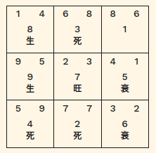

# 生死衰旺 (Sheng-Si Shuai-Wang)

Source: [src/shengsi.rs](../src/shengsi.rs)



生死衰旺 (Sheng-Si Shuai-Wang) is just a combination
of 4 Chinese characters, each being:

(1) Growing --> 生 (Sheng)  
(2) Deadly --> 死 (Si)  
(3) Perishing --> 衰 (Shuai)  
(4) Prosperous --> 旺 (Wang)  

They are often used in 四柱命理学 (The Four Pillars of Destiny),
but used in Feng-Shui as well. It simply suggests
that there are 4 states to the energy occupying the space.
In 玄空飞星風水 (Xuan-Kong Fei-Xing Feng-Shui),
it describes the state for the target year
in 三元九運 (Sang-Yuan Jiu-Yun),
especially, for its 向星 (Xiang-Xing).


## shengsi::ShengSi

A struct representing 生死衰旺 (Sheng-Si Shuai-Wang).
`key` would be: "sheng", "si", "shuai", or "wang".

```rust
#[derive(Debug, Clone, Deserialize, Serialize)]
pub struct ShengSi<'a> {
    pub key: &'a str,
    pub kanji: &'a str,
    pub meaning: &'a str,
}
```

## shengsi::ShengSiYearlyAlloc

A struct holding allocations of 生死衰旺 (Sheng-Si Shuai-Wang) for the given year.
For `usize` (in `Vec<usize>`) is 九星 (Jiu-Xing) index.

```rust
#[derive(Debug, Clone)]
pub struct ShengSiYearlyAlloc {
    pub wang: Vec<usize>,
    pub sheng: Vec<usize>,
    pub shuai: Vec<usize>,
    pub si: Vec<usize>,
}
```

## shengsi::SHENG_SI

`HashMap<&str, ShengSi>`

A HashMap for 生死衰旺 (Sheng-Si Shuai-Wang) by key
(for each holds `ShengSi`).

## shengsi::SHENG_SI_ALLOC

`Vec<ShengSiYearlyAlloc>`

For every year, some 九星 (Jiu-Xing) maybe in 旺 (Wang = Prospering)
phase, but some maybe in 死 (Si = Dying). 生死衰旺 (Sheng-Si Shuai-Wang)
for 九星 (Jiu-Xing) is no random, but has certain patterns,
and is repeated every 9 years. This cycle is called
三元九運 (Sang-Yuan Jiu-Yun), and given the 運盤星 (Un-Pan Xing) index
for the specific year, you can tell of 生死衰旺 (Sheng-Si Shuai-Wang)
for all the other 九星 (Jiu-Xing). Here, it is constructing
the patterns for 9 years, and making them into a static vector
for which each index being the 運盤星 (Un-Pan Xing) index.
If you know the 運盤星 (Un-Pan Xing) index for the year,
this static vector will tell you 生死衰旺 (Sheng-Si Shuai-Wang)
for all 九星 (Jiu-Xing).

## shengsi::get_shengsi_mapping

Given 運盤 (Un-Pan) index and given a layout for the current
運盤 (Un-Pan) positions (`&[usize; 9]`), returns the corresponding
生死衰旺 (Sheng-Si Shuai-Wang) situation.

Example:

```rust
use std::convert::TryInto;
use mikaboshi::shengsi::{get_shengsi_mapping, ShengSi};
use mikaboshi::test_mods::ShengSiParams;
use wasm_bindgen::prelude::*;

#[wasm_bindgen]
pub fn xx(params: &JsValue) -> JsValue {
    let params: ShengSiParams = params.into_serde().unwrap();
    let unpan_id: usize = params.unpan_id;
    let chart: [usize; 9] = params
        .unpan_xing_chart
        .try_into()
        .unwrap_or_else(|v: Vec<usize>| {
            panic!("Expected a Vec of length 9 but it was {}", v.len())
        });
    let mapping: Vec<Option<&ShengSi>> = get_shengsi_mapping(unpan_id, &chart);
    JsValue::from_serde(&mapping).unwrap()
}
```
